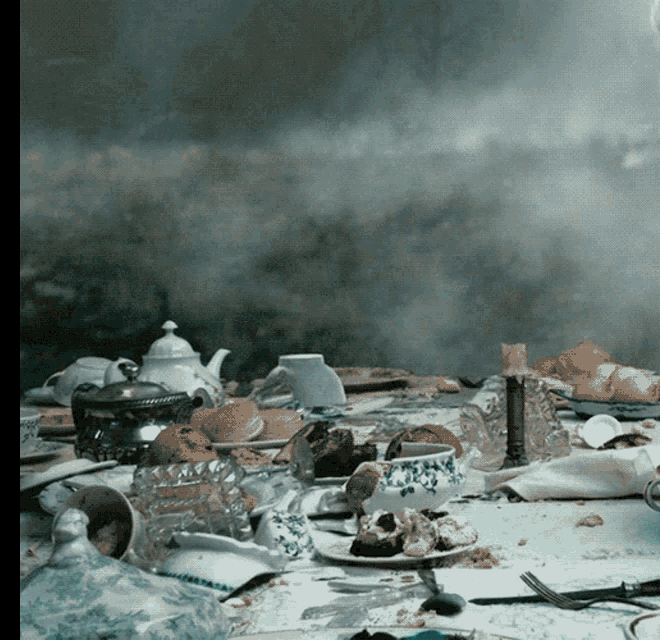

# Hiya, I'm Íter!

I’m way more used to working with Crowdin and handling the translations myself, so bear with me... *and please, don’t go on any 1,000 line translation marathons.* We’re not bilingual.

Since March 2, I’ve been rewriting and expanding the Spanish localization for the video game Final Sentence. The new localization will be included in the upcoming September language update, replacing the current clunky placeholder text. 

Also, since I still remember a thing or two about ICD-10 coding, I’m helping with a comprehensive review of the Spanish localization for Casualties: Unknown. Any help would be greatly appreciated, as there’s still a lot of work to be done. 

And lastly, drink black tea, get your 7,000 steps in every day, do some strength training, get plenty of sleep and go to bed at a decent hour, eat relatively healthy, socialize a little, and enjoy your intimate life... if that’s even possible when you live with family. 

  
#

 <em><strong>If caffeine is unavoidable, it should at least have the decency to come steeped.</strong></em> 

